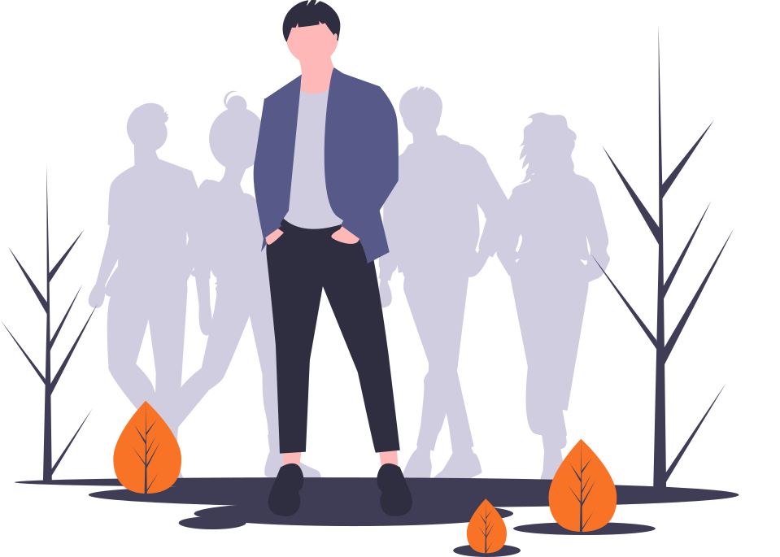

---
hide:
- navigation
- toc
---
<!-- ---------------------------------------- COMMON ---------------------------------------- -->

<!-- ---------------------------------------- TITLE SECTION ---------------------------------------- -->

    <h2>Mestios Guide</h2>

<!-- ---------------------------------------- FEATURES SECTION ---------------------------------------- -->

    Your voice matters!

    

- [X] Your opinion can influence minds
- [X] Your article may change public opinion
- [X] Even a single  :thumbsup:  will make a difference

<!-- ---------------------------------------- KEY-POINTS SECTION ---------------------------------------- -->

    Mestios Platform

    

        

            
        

        

            Platform to speak up your mind
        

        

            Mestios was created for everyone to freely tell your opinion just about anything. Tell the word your thoughts and support the statements you believe in. Stand for what's right and resist what's wong.
        

    

    

        

            
        

        

            Platform to defend your values
        

        

            Mestios is platform where you can stand for your values. Fight hypocrisy and prejudice. Stand for equality and tolerance. 
        

    

    

        

            
        

        

            Platform to express sentiments
        

        

            Mestios is a unified platform to express your sentiment about anything you can think of. Like or dislike products, companies, technologies, organisations, political parties, even entire governments and countries 
        

    

    

        

            
        

        

            Platform to identify true statements
        

        

            Mestios was created for everyone to support correct facts and fight against fake information. It is one place to collect materials, publications, opinions and voices to support the true stamenets and disprove the false ones.
        

    

    

        

            
        

        

            Platform to report fake information
        

        

            Mestios was created for everyone to support correct facts and fight against fake information. It is one place to collect materials, publications, opinions and voices to support the true stamenets and disprove the false ones.
        

    

    

        

            
        

        

            Platform to understand public opinions 
        

        

            We want to know what are our collective beliefs and thoughts. The goal of Mestios is to explain our collective opinions in regards of any topic.
        

    

    

        

            
        

        

            Platform to shape public opinions
        

        

            Mestios is a place where you can contribute to the formation of collective public opinion by speaking up on the topics of interest, even by simply liking the opinions of others.
        

    

    

        

            
        

        

            Platform for constructive conversations
        

        

            Mestios is a platform for the constructive and reasonable converstaions. The format of conversations encourages well-structured opinions to discuss statements. Platform discourages useless quarells, hate speech and personal harassment.  
        

    

    

        

            
        

        

            Platform of concensus
        

        

            Mestios goal is to find ideas that unite people. Contributors that help to achieve this are motivated. Polarisation of society is discouraged.
        

    

    

        

            
        

        

            UPlatform to unlock collective intelligence
        

        

            The intention of Mestios is to make a platform where through collaboration we could find solutions for the actual problems.
        

    

    

        

            
        

        

            A platform where everyone contributes
        

        

            It does not matter if you are an active user or passive reader, if you prefer to explain your thoughts as short statements or lengthy texts, Mestios platform provides a way for everyone to express your thoughts and beliefs. Everything is connected, and even a passive participation counts towards the evaluation of the public opinion. 
        

    

<!-- ---------------------------------------- ACTIVITIES ACCENT SECTION ---------------------------------------- -->

    Join Mestios community 

    

        
        

            Make statements you believe in about the facts which you know are true. 
        

    

    

        
        

            Prove your statements with materials, publicatios and other trustworthy sources. 
        

    

    

        
        

            Come up with new ideas and share them with the community. 
        

    

    

        
        

            Argue about public statements you support or reject. 
        

    

    

        
        

            Verify public statements. Help to establish true facts and denounce fake information. 
        

    

    

        
        

            Express your sentiment towards just anything at any time. 
        

    

    

        
        

            Read, analyze and comment the latest news. 
        

    

    

        
        

            Share most recent events together with your attitude towards them. 
        

    

    

        
        

            Post your opinions and start the constructive discussions. 
        

    

    

        
        

            Write analytical publications and analyze statements.
        

    

    

        
        

            Connect statements with the relations of logical reasoning.
        

    

    

        
        

            Link entities through sentiment relations, and contribute to the graph of all entities.
        

    

    

        
        

            Participate in collective brainstorming to find solutions for actual problems.
        

    

    

        
        

            Become community leader, grow your network and improve your domain expertise.
        

    

    

        
        

            Help to keep community safe from uncivilized conversations.
        

    

